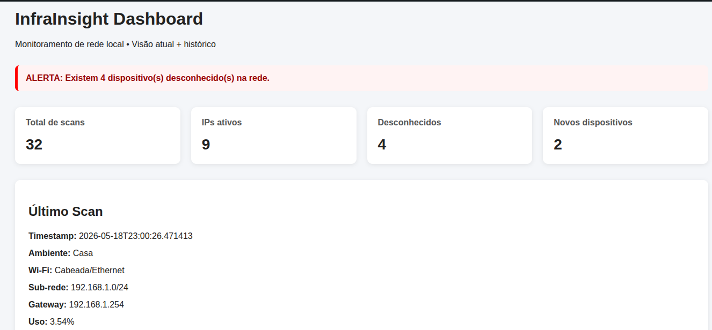
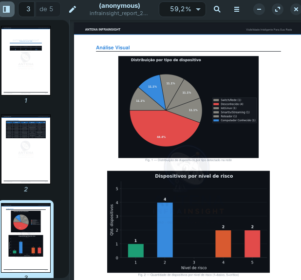

#  &nbsp; Antena InfraInsight

<p align="center">
  
</p>

<p align="center">
  <strong>Visibilidade Inteligente Para Sua Rede</strong><br/>
  Plataforma de observabilidade e análise contextual de redes locais com classificação inteligente, dashboard web e relatórios PDF profissionais.
</p>

<p align="center">
  
  
  
  
  
  
</p>

---

# 📡 Sobre o Projeto

O **Antena InfraInsight** é uma plataforma de visibilidade inteligente para redes locais desenvolvida em Python.

O sistema realiza:

- descoberta de dispositivos
- classificação contextual
- análise básica de risco
- persistência histórica
- visualização em dashboard
- geração automática de relatórios PDF

O objetivo é transformar informações técnicas de rede em inteligência visual e operacional acessível.

---

# 🎯 Objetivo

Redes locais geralmente possuem baixa visibilidade sobre:

- dispositivos conectados
- equipamentos desconhecidos
- comportamento da infraestrutura
- possíveis riscos contextuais

O InfraInsight busca resolver isso através de:

✅ descoberta automatizada  
✅ classificação inteligente  
✅ scoring contextual de risco  
✅ visualização centralizada  
✅ relatórios profissionais  

---

# 🖥️ Screenshots

## Dashboard Web

<p align="center">
  
  <br/>
  <em>Dashboard Flask com métricas em tempo real</em>
</p>

---

## Relatório PDF

<p align="center">
  
  <br/>
  <em>Relatório PDF profissional com gráficos embutidos e marca d'água</em>
</p>

---

# ✨ Funcionalidades

| Módulo | Descrição |
|--------|-----------|
| 🔍 Scanner de Rede | Descoberta automática de hosts via Nmap |
| 🌐 Detecção de Gateway | Identificação automática do gateway da rede |
| 🧠 Classificação Inteligente | Classificação contextual baseada em vendor e comportamento |
| 🖥️ Dashboard Flask | Visualização web com métricas em tempo real |
| 📊 Gráficos | Pizza, barras e evolução temporal com Matplotlib |
| 📄 PDF Profissional | Relatórios executivos com branding e gráficos |
| 🗄️ Persistência | Histórico em JSON e SQLite |
| 📡 Integração DD-WRT/OpenWRT | Coleta opcional via SSH em roteadores compatíveis |
| 🧾 Histórico Temporal | Evolução de dispositivos por scans |

---

# 🧠 Como Funciona

O fluxo do InfraInsight segue quatro etapas principais:

```text
Detectar → Classificar → Priorizar → Reportar
````

## 1. Descoberta

O sistema identifica hosts ativos na sub-rede local utilizando Nmap.

## 2. Classificação

Os dispositivos são classificados automaticamente por:

* vendor
* hostname
* gateway
* comportamento esperado

## 3. Análise de Risco

Cada host recebe um score contextual de risco.

## 4. Visualização

Os resultados são enviados para:

* dashboard web
* banco SQLite
* relatório PDF

---

# 📊 Categorias de Dispositivos

| Categoria              | Descrição                      |
| ---------------------- | ------------------------------ |
| `gateway`              | Roteador / gateway             |
| `computador_conhecido` | PCs e notebooks                |
| `switch_infra`         | Equipamentos de infraestrutura |
| `smarttv_streaming`    | TVs e streaming                |
| `iot_rede`             | Dispositivos IoT               |
| `camera`               | Câmeras IP                     |
| `impressora`           | Impressoras                    |
| `mac_randomizado`      | MAC aleatório                  |
| `desconhecido`         | Não identificado               |

---

# ⚠️ Risk Scoring

O score varia de:

* **1 → baixo risco**
* **5 → risco crítico**

A análise considera:

* tipo do dispositivo
* fabricante
* MAC randomizado
* recorrência no histórico
* classificação desconhecida
* contexto da rede

---

# 🗂️ Estrutura do Projeto

```text
InfraInsight/
│
├── scanner.py
├── config.json
├── requirements.txt
├── README.md
│
├── modulos/
│   ├── classificador.py
│   ├── ddwrt.py
│   ├── graph_generator.py
│   ├── host_local.py
│   ├── vendor_intelligence.py
│   └── risk_scoring.py
│
├── dashboard/
│   ├── app.py
│   ├── templates/
│   └── static/
│
├── reports/
│   ├── pdf_report.py
│   └── graficos/
│
├── storage/
│   └── infrainsight.db
│
├── assets/
│   ├── logo.png
│   ├── logo_vertical.png
│   ├── banner.png
│   └── screenshots/
│
└── historico_dispositivos.json
```

---

# 🚀 Instalação

## Pré-requisitos

### Linux (Ubuntu/Debian)

```bash
sudo apt update
sudo apt install nmap python3-venv
```

---

## ⚙️ Setup

### 1. Clone o repositório

```bash
git clone https://github.com/britox-x/InfraInsight.git
cd InfraInsight
```

### 2. Crie o ambiente virtual

```bash
python3 -m venv venv
source venv/bin/activate
```

### 3. Instale as dependências

```bash
pip install -r requirements.txt
```

---

# ▶️ Uso

## Executar Scanner

```bash
sudo python scanner.py
```

---

## Executar Dashboard

```bash
cd dashboard
python app.py
```

Acesse:

```text
http://localhost:5000
```

---

# 📄 Relatórios PDF

O sistema gera automaticamente relatórios PDF contendo:

* capa executiva
* inventário de dispositivos
* gráficos
* resumo estatístico
* marca d'água
* branding visual

Os relatórios ficam em:

```text
reports/
```

---

# 📈 Dashboard

O painel web exibe:

* IPs ativos
* risco médio
* desconhecidos
* gráficos
* histórico temporal
* resumo da rede

---

# 🗄️ Persistência

O projeto utiliza:

| Tecnologia | Uso                   |
| ---------- | --------------------- |
| SQLite     | Histórico persistente |
| JSON       | Evolução temporal     |
| Matplotlib | Geração de gráficos   |
| ReportLab  | Relatórios PDF        |

---

# 📦 Dependências Principais

* Flask
* python-nmap
* matplotlib
* reportlab
* Pillow
* sqlite3
* python-dotenv

---

# 🧪 Compatibilidade

O InfraInsight funciona em:

✅ Redes domésticas
✅ Home Labs
✅ Pequenas redes corporativas
✅ DD-WRT
✅ OpenWRT
✅ Gateways Linux-based
✅ Fallback automático via Nmap

---

# 🛣️ Roadmap

## MVP Atual

* [x] Scanner de rede
* [x] Descoberta automática de hosts
* [x] Classificação inteligente
* [x] Risk scoring
* [x] Dashboard Flask
* [x] Persistência SQLite
* [x] Relatórios PDF
* [x] Gráficos automáticos
* [x] Branding visual

---

## Próximas Versões

* [ ] Alertas em tempo real
* [ ] Múltiplas sub-redes
* [ ] API REST
* [ ] Docker Compose
* [ ] Exportação CSV
* [ ] Fingerprinting avançado
* [ ] Vendor intelligence offline

---

# 🎓 Objetivo Acadêmico

O InfraInsight também é utilizado como projeto acadêmico/TCC focado em:

* observabilidade
* segurança
* redes
* automação
* análise contextual

---

# 💼 Aplicações

* Inventário de rede
* Home labs
* Ambientes educacionais
* Pequenas empresas
* Observabilidade local

---

# 🤝 Contribuição

Pull requests são bem-vindos.

Para mudanças maiores:

* abra uma issue
* descreva a proposta
* explique o objetivo da alteração

---

# 📄 Licença

MIT License

---

# 👨‍💻 Autor

Desenvolvido por:

**Matheus Brito**

---

<p align="center">
  <strong>Antena InfraInsight</strong><br/>
  <em>Visibilidade Inteligente Para Sua Rede</em>
</p>
```
